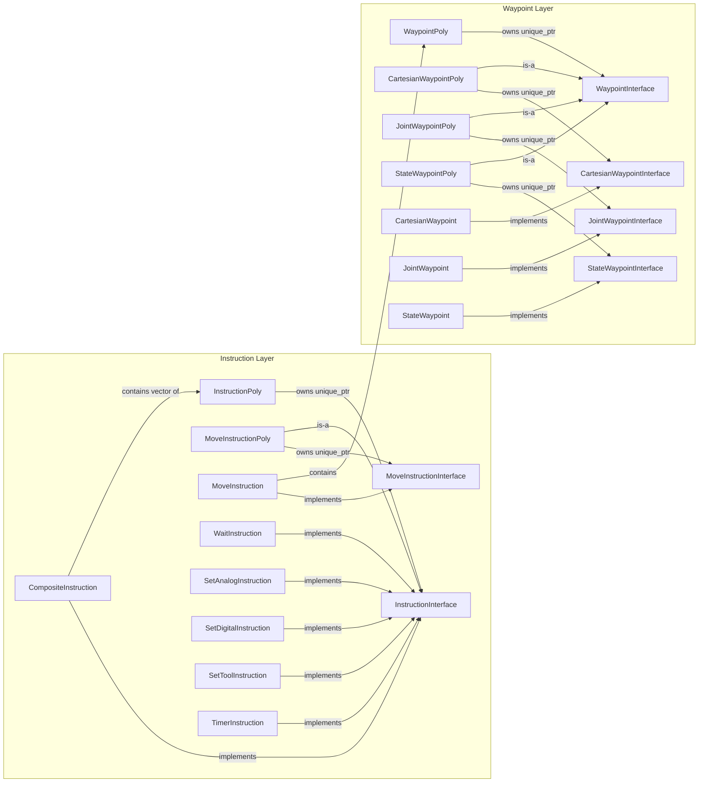
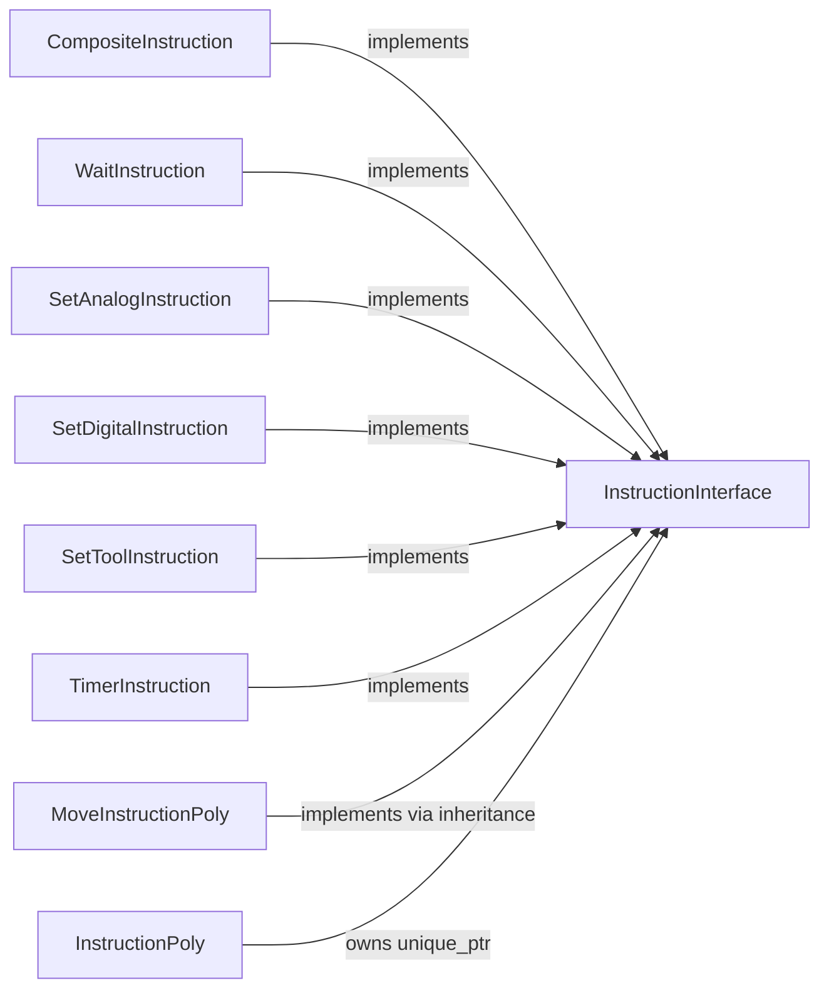
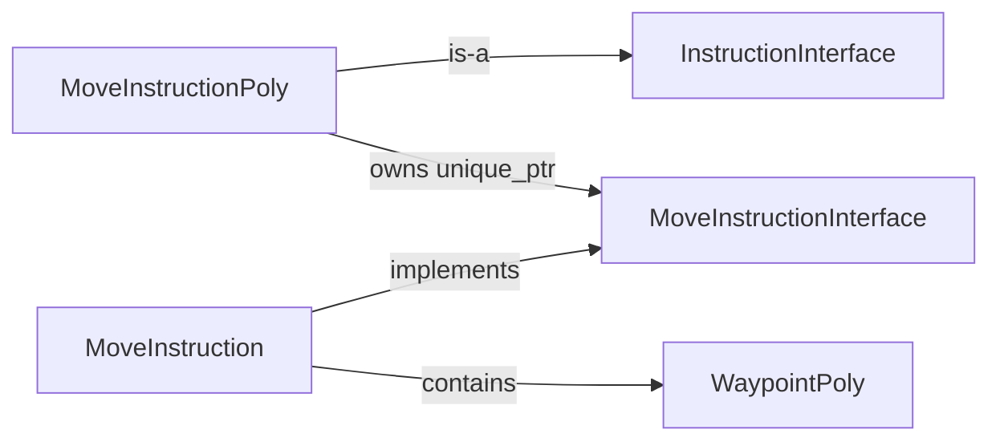
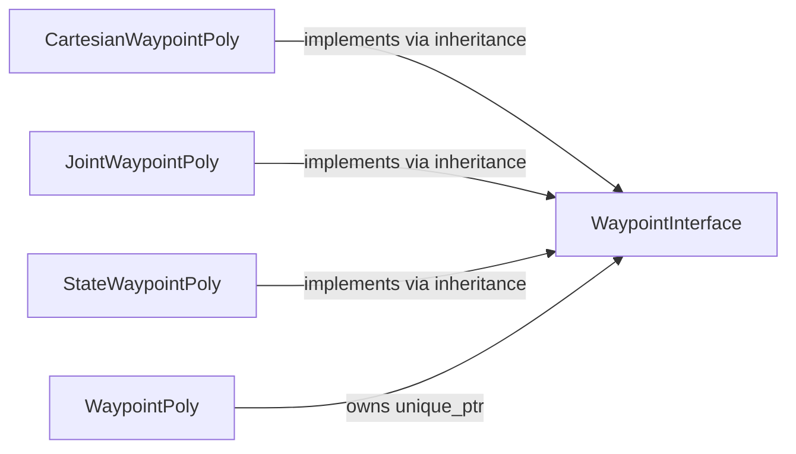
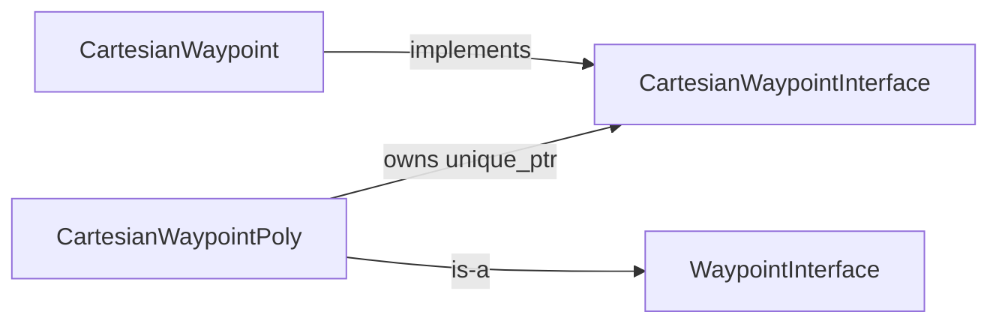
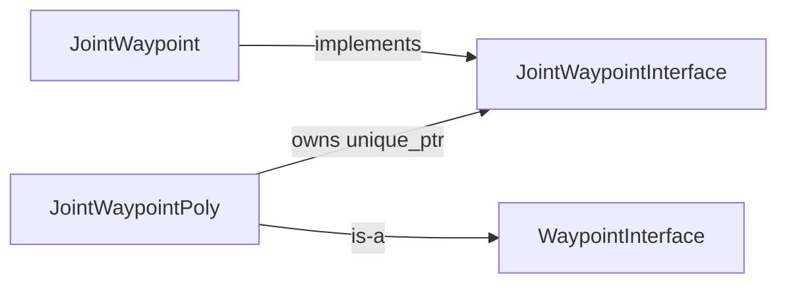
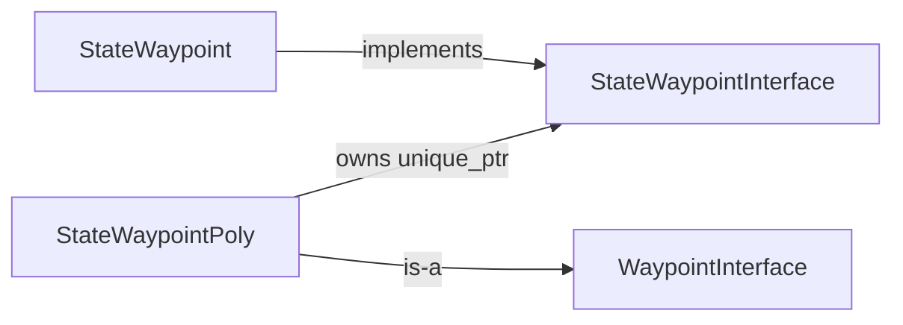
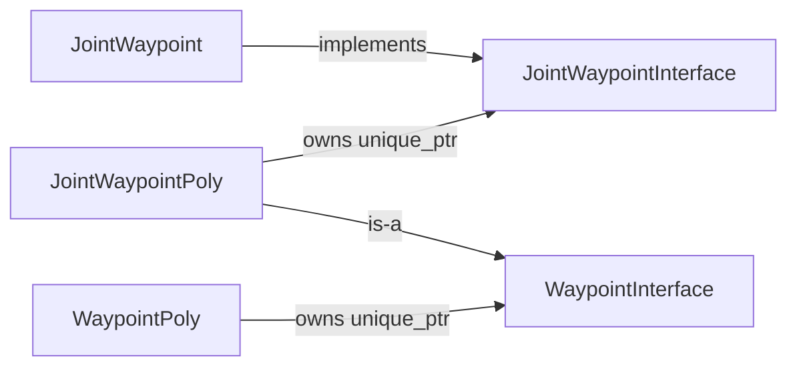
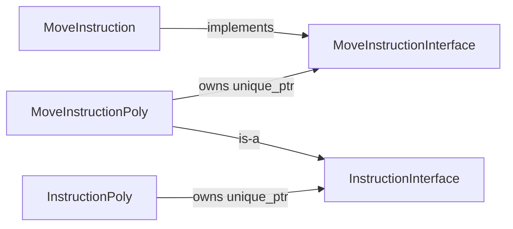

# Command Language Poly Type Design

This package uses a layered polymorphism pattern built around interfaces and owning wrapper types.

More specifically, the central mechanism is type erasure.

The short version:

- The non-poly classes are the concrete data models.
- The `*Interface` classes define the behavior that can be used polymorphically.
- The `*Poly` classes are owning, copyable, type-erased wrappers around interface pointers.
- The generic poly types, `InstructionPoly` and `WaypointPoly`, let the package store heterogeneous instructions and waypoints by value.

This is why `MoveInstruction` is not derived from `MoveInstructionPoly`, and `JointWaypoint` is not derived from `JointWaypointPoly`: the poly types are type-erased wrappers, not bases.

## Type Erasure

Type erasure is the mechanism being used here.

In this package, type erasure means code can work with a value through a common wrapper type without needing to know the original concrete type at compile time.

For example:

- a `WaypointPoly` can hold a cartesian, joint, or state waypoint
- an `InstructionPoly` can hold several different instruction kinds

The concrete type is hidden behind an interface pointer owned by the poly wrapper. The wrapper exposes a stable API, and the concrete type-specific details are erased from the public type of the variable.

That is why a function can accept a `WaypointPoly` or `InstructionPoly` and still operate correctly on many different underlying concrete types.

In this package, the type erasure pattern has four pieces:

1. A concrete type with real stored data

Examples: `MoveInstruction`, `JointWaypoint`, `CartesianWaypoint`, `StateWaypoint`.

2. An interface that describes the operations needed polymorphically

Examples: `MoveInstructionInterface`, `JointWaypointInterface`, `WaypointInterface`, `InstructionInterface`.

3. A type-erased wrapper that owns an interface pointer

Examples: `MoveInstructionPoly`, `JointWaypointPoly`, `WaypointPoly`, `InstructionPoly`.

4. A cloning API so the erased object still behaves like a value

This is what preserves copy semantics instead of falling back to shared mutable base pointers.

So the pattern here is not just inheritance-based runtime polymorphism. It is value-oriented type erasure built on top of interfaces and clone-based ownership.

## Type Erasure vs Ordinary Inheritance

Ordinary inheritance alone would usually leave you passing around base-class pointers or references directly.

This design goes further:

- the concrete type is wrapped in a copyable value object
- the wrapper owns the polymorphic object
- the wrapper provides runtime queries like `getType()`, `is...()`, and `as<T>()`
- callers can store heterogeneous objects by value without exposing raw ownership everywhere

That is the practical benefit of the poly types: they erase the concrete type from the variable's static type while still keeping safe access to polymorphic behavior.

## Why This Exists

The pattern solves three separate problems at once.

1. Heterogeneous storage

`MoveInstruction` needs to hold one of several waypoint kinds. `CompositeInstruction` needs to hold one of several instruction kinds. The generic poly types make that possible without templates in the public API.

2. Value semantics

The type-erased poly wrappers own their implementation and deep-copy it through `clone()`. Copying a poly object behaves like copying a value, not like copying a raw base pointer.

3. Type-specific APIs without losing generic access

Code can stay generic for most operations, then use `is...()` or `as<T>()` when it really needs a specific concrete type.

## Core Rule

Each poly type wraps an interface pointer. The concrete type implements the interface. The poly type forwards calls to the wrapped interface object.

This forwarding wrapper is the type-erased value object.

That means the shape is:

```text
ConcreteType -> implements -> SpecializedInterface
SpecializedPoly -> owns -> SpecializedInterface
GenericPoly -> owns -> GenericInterface
```

Sometimes the specialized poly also acts as the bridge into the generic interface layer.

## Full Poly Inventory

There are six poly headers in this package:

- `poly/instruction_poly.h`
- `poly/move_instruction_poly.h`
- `poly/waypoint_poly.h`
- `poly/cartesian_waypoint_poly.h`
- `poly/joint_waypoint_poly.h`
- `poly/state_waypoint_poly.h`

## Overall Architecture



## Instruction Poly Types

### `InstructionPoly`

Purpose: generic, type-erased value wrapper for any instruction that implements `InstructionInterface`.

This is the top-level container used anywhere the code wants to store instructions generically, especially inside `CompositeInstruction`.



Important detail:

- `InstructionPoly` does not know about concrete `MoveInstruction` directly.
- It knows about `InstructionInterface`.
- `MoveInstruction` reaches this layer through `MoveInstructionPoly`.

### `MoveInstructionPoly`

Purpose: specialized, type-erased wrapper for move instructions.

It exists because move instructions have a richer API than generic instructions. Generic instructions all share UUID, description, cloning, and printing. Move instructions add motion-specific behavior such as waypoint access, profiles, manipulator info, move type, and conversion helpers.

`MoveInstructionPoly` preserves that richer API while still being storable as a generic `InstructionInterface` through inheritance.



Why it is not `MoveInstruction : public MoveInstructionPoly`:

- `MoveInstruction` is the implementation object.
- `MoveInstructionPoly` is the owning, type-erased polymorphic wrapper around `MoveInstructionInterface`.
- Making the concrete class derive from the wrapper would invert the layering and defeat the purpose of the wrapper.

## Waypoint Poly Types

### `WaypointPoly`

Purpose: generic, type-erased value wrapper for any waypoint that can be treated as a `WaypointInterface`.

This is what `MoveInstruction` stores. It allows one move instruction to carry a cartesian, joint, or state waypoint without templating `MoveInstruction` on waypoint type.



Important detail:

- `WaypointPoly` usually stores one of the specialized waypoint poly types, not the concrete waypoint directly.
- The specialized poly types are the bridge from specialized waypoint interfaces into the generic waypoint interface.

### `CartesianWaypointPoly`

Purpose: specialized, type-erased wrapper for cartesian waypoint behavior while still participating in the generic waypoint layer.



Why it exists:

- Cartesian-specific code needs methods like `getTransform()`, tolerances, and seed access.
- Generic waypoint code only needs the `WaypointInterface` surface.
- `CartesianWaypointPoly` gives both.

### `JointWaypointPoly`

Purpose: specialized, type-erased wrapper for joint waypoint behavior while still participating in the generic waypoint layer.



Why it exists:

- Joint-specific code needs names, positions, tolerances, and constraint state.
- Generic waypoint code only needs name, print, clone, and equality through the base layer.

### `StateWaypointPoly`

Purpose: specialized, type-erased wrapper for full state waypoint behavior while still participating in the generic waypoint layer.



Why it exists:

- State waypoints expose names, position, velocity, acceleration, effort, and time.
- Generic waypoint code still only needs the common waypoint surface.

## The Two-Step Bridge on the Waypoint Side

The waypoint side has one extra layer that can be easy to miss.

`JointWaypoint` does not implement `WaypointInterface` directly. It implements `JointWaypointInterface`.

Then `JointWaypointPoly`:

- owns a `JointWaypointInterface`
- forwards joint-specific operations to it
- also inherits from `WaypointInterface`

That lets `WaypointPoly` hold `JointWaypointPoly` as a generic waypoint.

The same pattern is used for cartesian and state waypoints.



This is the key answer to the original question about why the non-poly class is not derived from the poly class.

The concrete class does not derive from the poly wrapper because the poly wrapper is a type-erased adapter layer. The poly wrapper sits beside the concrete type, not above it.

## The Two-Step Bridge on the Instruction Side

The instruction side is similar, but only move instructions get their own specialized poly wrapper.

Most instruction types implement `InstructionInterface` directly and can go straight into `InstructionPoly`.

`MoveInstruction` is different because it has a specialized API. So the package uses:

- `MoveInstructionInterface` for move-specific behavior
- `MoveInstruction` as the concrete implementation
- `MoveInstructionPoly` as the specialized, type-erased wrapper that can also be treated as a generic instruction



## Copy and Lifetime Semantics

The poly types are designed to behave like values.

- Copying a poly object clones the wrapped implementation.
- Moving a poly object transfers ownership of the wrapped implementation.
- Equality compares the wrapped objects, including runtime type.
- `getType()` and `as<T>()` allow checked runtime dispatch when generic code needs to recover a specific type.

This avoids common base-pointer ownership problems while keeping runtime polymorphism.

That combination is the important point: the package is using type erasure to get runtime polymorphism with value semantics.

## Practical Mental Model

When reading or extending this package, it helps to think in these terms:

- Concrete class: where the actual data lives.
- Interface: the behavior contract for polymorphism.
- Specialized poly: an owning, type-erased adapter for one specialized family.
- Generic poly: an owning, type-erased adapter for a fully generic container layer.

In other words:

```text
Concrete object
  -> implements an interface
  -> gets wrapped by a poly type
  -> can then be stored in a generic poly container
```

## Quick Reference

| Poly type | Owns | Also acts as | Main reason it exists |
| --- | --- | --- | --- |
| `InstructionPoly` | `InstructionInterface` | Generic type-erased instruction value | Store heterogeneous instructions |
| `MoveInstructionPoly` | `MoveInstructionInterface` | Type-erased `InstructionInterface` value | Preserve move-specific API and still behave like a generic instruction |
| `WaypointPoly` | `WaypointInterface` | Generic type-erased waypoint value | Store heterogeneous waypoints |
| `CartesianWaypointPoly` | `CartesianWaypointInterface` | Type-erased `WaypointInterface` value | Preserve cartesian-specific API and still behave like a generic waypoint |
| `JointWaypointPoly` | `JointWaypointInterface` | Type-erased `WaypointInterface` value | Preserve joint-specific API and still behave like a generic waypoint |
| `StateWaypointPoly` | `StateWaypointInterface` | Type-erased `WaypointInterface` value | Preserve state-specific API and still behave like a generic waypoint |

## Bottom Line

The poly classes are not alternative concrete instruction or waypoint classes.

They are the package's mechanism for turning interface-based polymorphism into copyable, storable values. That is why the non-poly concrete types do not derive from the poly types: the poly types wrap them through interfaces instead of sitting in their inheritance chain.